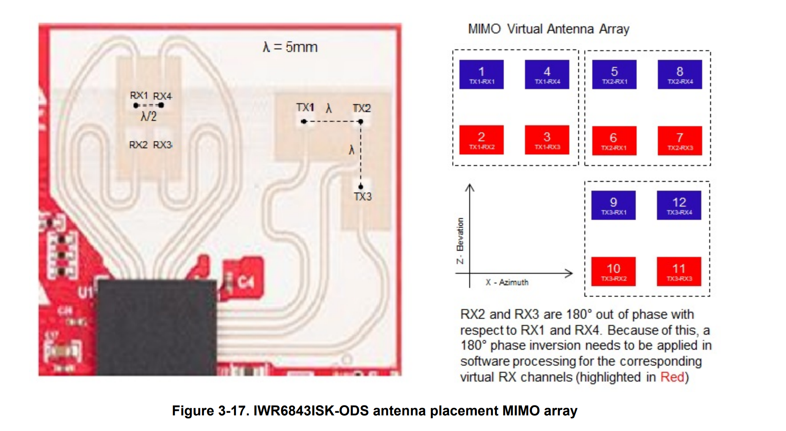
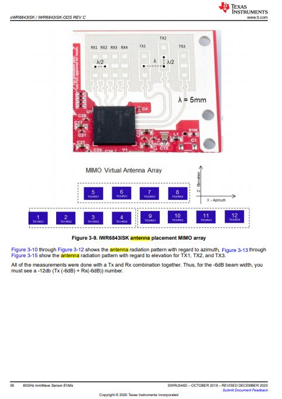
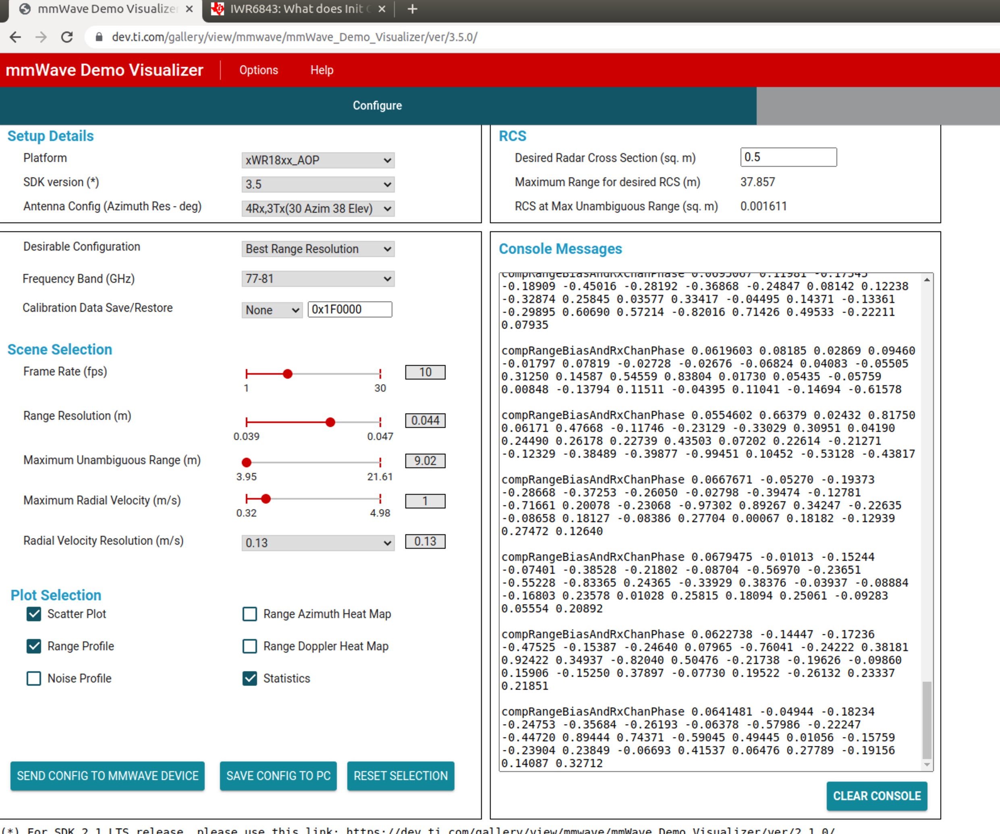

<style>
r { color: Red }
o { color: Orange }
g { color: Green }
</style>






# antenna calculate
https://e2e.ti.com/support/sensors-group/sensors/f/sensors-forum/908009/ccs-iwr6843aop-oob-68xxhwa-ant-define-error-antenna_geometry-c

```
Hello


Seems like definition of AntGemetry  struct is not easy to find. We will look into it.

To understand the struct, following seems to be the the grid along which antenna is layed out:

1. Consider the top left corner of the Tx  (and Rx) antennas as Reference = (0,0)  ie. X=0, Y=0

2. Struct specifies the offset of each antenna from this  Reference location in values of labmda/2 multiples.

3. For X values -->  Increments values from left to right for Lambda/2 counts

4. For Y values --> Increments values from top to bottom for Lambda/2 counts

Please let us know if that helped.

Thank you,

Vaibhav

```

```
The Antenna Geometry structure is explained in SDK module documentation under AoA2DProc DPU (Angle of Arrival using 2D FFT Method). You can access it as shown below:

- Navigate to C:\ti\mmwave_sdk_03_04_xx_xx\docs and and open the file mmwave_sdk_module_documentation.html in a browser.
- Click on the AoA using 2D FFT method link as highlighted in the picture below:
- Scroll down to the section named Antenna Geometry Definition, which explains how the generic antenna geometry structure is defined and used by the HWA AoA2dProc DPU code. The antenna geometry for a specific antenna (for example, xWR6843AoP ES2.0) is defined in the corresponding C structure in mmwave_sdk_03_04_xx_xx\packages\ti\board\antenna_geometry.c.
- Phase rotation: Phase rotation is configured using the compRangeBiasAndRxChanPhase CLI command available in the mmw demo as shown in the SDK user guide below:
For more details, including comparison pictures of AOP ES1.0 and ES2.0 antennas, please refer to section 4.2.2 xWR6843AoP ES2.0 - AoA Software Updates of the following app note: Migrating to xWR68xx and xWR18xx Millimeter Wave Sensors

 Regards

-Nitin
```

# calibration
```
-> how to
file:///Volumes/Case/mmwave/ti/mmwave_industrial_toolbox_4_7_0/labs/people_counting/overhead_3d_people_counting/docs/overhead_3d_people_counting_user_guide.html
-> how to
file:///Volumes/Case/mmwave/ti/mmwave_sdk_03_05_00_04/packages/ti/demo/xwr68xx/mmw/docs/doxygen/html/index.html
-> command
MmwDemo_CLIMeasureRangeBiasAndRxChanPhaseCfg()
file:///Volumes/Case/mmwave/ti/mmwave_sdk_03_05_00_04/packages/ti/demo/xwr16xx/mmw/docs/doxygen/html/globals_m.html
-> chagne user cfg
compRangeBiasAndRxChanPhase

file:///Volumes/Case/mmwave/ti/mmwave_sdk_03_05_00_04/docs/mmwave_sdk_user_guide.pdf
```

# Range Bias and Rx Channel Gain/Offset Measurement and Compensation
Refer to the section ""Range Bias and Rx Channel Gain/Offset Measurement and Compensation"" in the mmwave_sdk_<ver>\packages\ti\datapath\dpc\
objectdetection\<chain_type>\docs\doxygen\html\index.html documentation for the procedure and internal implementation details. To execute the
procedure using Visualizer GUI, here are the steps:

1. Set the target as explained in the demo documentation and update the <r>mmwave_sdk_<ver>\packages\ti\demo\<platform>\mmw\profiles\profile_calibration.cfg</r> appropriately.

2. Set up Visualizer and mmW demo as mentioned in the section Running the Demos.

3. Use the ""Load Config From PC and Send"" button on plots tab to send the <r>mmwave_sdk_<ver>\packages\ti\demo\<platform>\mmw\profiles\profile_calibration.cfg</r>.

4. The Console messages window on the Configure tab will dump the ""compRangeBiasAndRxChanPhase"" command to be used for subsequent runs where compensation is desired.

5. Copy and save the string for that particular mmWave sensor to your PC. You can use it in the ""Advanced config"" tab in the Visualizer and
   tune any running profile in real time. Alternatively, you can add this to your custom profile configs and use it via the ""Load Config From PC
   and Send"" button.

## default(AWR1843AOP):
compRangeBiasAndRxChanPhase 0.0 1 0 1 0 1 0 1 0 1 0 1 0 1 0 1 0 1 0 1 0 1 0 1 0


## output:
```
compRangeBiasAndRxChanPhase -0.0128281 0.47336 0.45468 0.63620 0.43164 0.47879 0.43585 0.60052 0.25476 -0.23920 -0.97098 -0.18732 -0.83527 -0.09763 -0.48718 -0.24277 -0.52823 0.94864 0.22208 0.44437 0.69424 0.27283 0.58420 0.60782 0.66550

compRangeBiasAndRxChanPhase -0.0025509 0.44986 0.38507 0.49722 0.44604 0.39127 0.38208 0.52872 0.22775 -0.34631 -0.93811 -0.19189 -0.75006 -0.14056 -0.47440 -0.31754 -0.50122 0.75406 0.38696 0.27631 0.66464 0.19391 0.54745 0.44617 0.69498

compRangeBiasAndRxChanPhase -0.0142667 0.34555 0.31793 0.38806 0.33328 0.30640 0.30527 0.38571 0.17154 -0.08313 -0.99655 -0.08801 -0.66074 -0.08630 -0.39359 -0.22903 -0.39633 0.74078 0.23721 0.19946 0.59003 0.12711 0.45673 0.33102 0.54230

compRangeBiasAndRxChanPhase -0.0167677 0.38330 0.36801 0.47714 0.30682 0.39865 0.30228 0.43890 0.15710 -0.04648 -0.99893 -0.12576 -0.73410 -0.08167 -0.43121 -0.23743 -0.46378 0.79538 0.11328 0.35657 0.57312 0.21744 0.48730 0.43661 0.54303

compRangeBiasAndRxChanPhase -0.0168642 0.22168 0.22342 0.18030 0.23633 0.14194 0.18039 0.18857 0.10358 0.38412 -0.92328 0.05051 -0.44324 -0.02737 -0.25961 -0.13486 -0.26474 0.51614 0.08435 0.09702 0.40067 0.08676 0.29773 0.15329 0.35788

compRangeBiasAndRxChanPhase -0.0170105 0.23187 0.22363 0.20667 0.24698 0.15195 0.18695 0.20074 0.10419 0.45126 -0.89240 0.04550 -0.48593 -0.02847 -0.28049 -0.14987 -0.28357 0.52667 0.03296 0.12979 0.42316 0.09677 0.31842 0.16135 0.37967
```

## 角反射器
https://e2echina.ti.com/support/archived-forums/f/other-analog-forum/200315/iwr1843?tisearch=e2e-sitesearch&keymatch=IWR1843