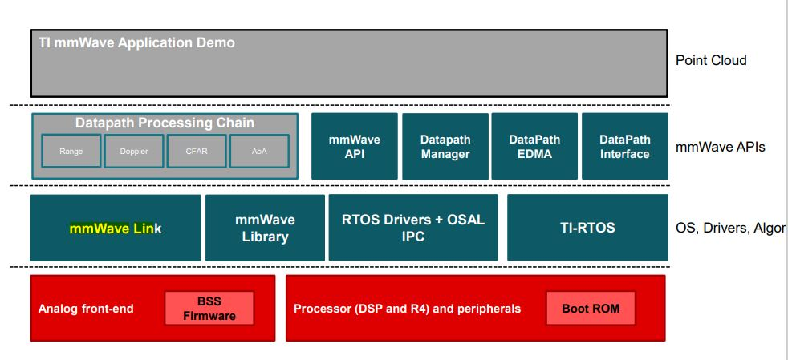

```
datapath/
├── REAMME.md
├── dpc
│   ├── dpu
│   └── objectdetection
├── dpedma
│   ├── docs
│   ├── dpedma.h
│   ├── dpedmahwa.h
│   ├── dpedmalib.mak
│   ├── include
│   ├── lib
│   ├── makefile
│   └── src
├── dpif
│   ├── dp_error.h
│   ├── dpif_adcdata.h
│   ├── dpif_detmatrix.h
│   ├── dpif_pointcloud.h
│   ├── dpif_radarcube.h
│   ├── dpif_types.h
│   ├── dpif_utils.h
│   └── src
├── dpu
    └── rangeproc
```

```
~/ti/mmwave_sdk_03_05_00_04/packages/ti/datapath/dpc/objectdetection dev* ⇡
(base) base ❯ tree -L 2 ./
./
├── common
│   ├── docs
│   ├── gen_frame_data.c
│   ├── gen_frame_data.h
│   └── test_data_path.h
├── objdetdsp
│   ├── docs
│   ├── include
│   ├── makefile
│   ├── objectdetection.h
│   ├── src
│   └── test
├── objdethwa
│   ├── docs
│   ├── include
│   ├── makefile
│   ├── objectdetection.h
│   ├── src
│   └── test
└── objdetrangehwa
    ├── docs
    ├── include
    ├── objdetrangehwa.h
    └── src
```

```
opo2000tw@opo2000tw-vmware:~/ti/mmwave_sdk_03_05_00_04/packages/ti/datapath/dpc$ tree -L 2 ./
 ├── dpu
 │   ├── aoa2dproc
 │   ├── aoaproc
 │   ├── cfarcaproc
 │   ├── dopplerproc
 │   └── staticclutterproc
 └── objectdetection
     ├── common
     ├── objdetdsp
     ├── objdethwa
     └── objdetrangehwa
```
12 directories, 11 files
