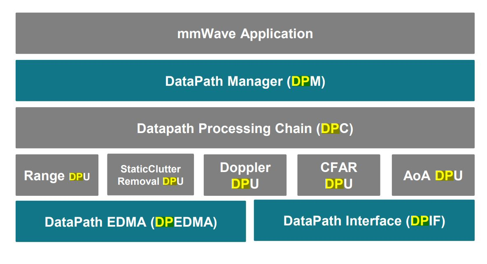

# Datapath Layer Design

## DPM: Datapath manager
– Foundation layer that enables the "scalability" aspect of the 
architecture.

## DPIF: Standard Interface points in the Detection chain are 
defined
– Input ADC data, Radar Cube, Detection Matrix, Point cloud

## DPUs: Data Translating function(s) from one interface point to the other are called “Data Processing Units”
– Range Processing (ADC data to Radar Cube)
– Doppler Processing (Radar Cube to Detection Matrix)
– CFAR and AoA (Detection Matrix to Point Cloud)

## DPC: Data Processing Chain 
– Chain of “data processing units” is called a data processing Chain. 
Ex: Detection DPC (ADC to Point Cloud).
– This conforms to the DPM dictated API definition

