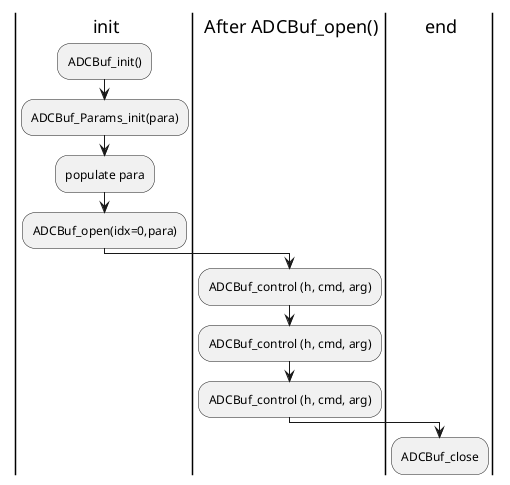

```
void ADCBuf_close (ADCBuf_Handle handle)
int_fast16_t ADCBuf_control (ADCBuf_Handle handle, uint_fast8_t cmd, void *arg)
uint32_t ADCBuf_getChanBufAddr (ADCBuf_Handle handle, uint8_t channel, int32_t *errCode)
uint32_t ADCBUF_MMWave_getCQBufAddr (ADCBuf_Handle handle, ADCBufMMWave_CQType cqType, int32_t *errCode)
void ADCBuf_Params_init (ADCBuf_Params *params)
ADCBuf_Handle ADCBuf_open (uint_fast8_t index, ADCBuf_Params *params)
```

```
*.cfg
-> enable
analogMonitor 1 1 = MmwDemo_CLIAnalogMonitorCfg(MmwDemo_AnaMonitorCfg)
-> set
ADCBuf_control(h,ADCBufMMWave_CMD_CONF_CQ,err)
<- get
ADCBUF_MMWave_getCQBufAddr()
```

``` #relationship
hsiheader.c <-> ADCBuf_getChanBufAddr
cbuff.c     <-> ADCBuf_getChanBufAddr
```


